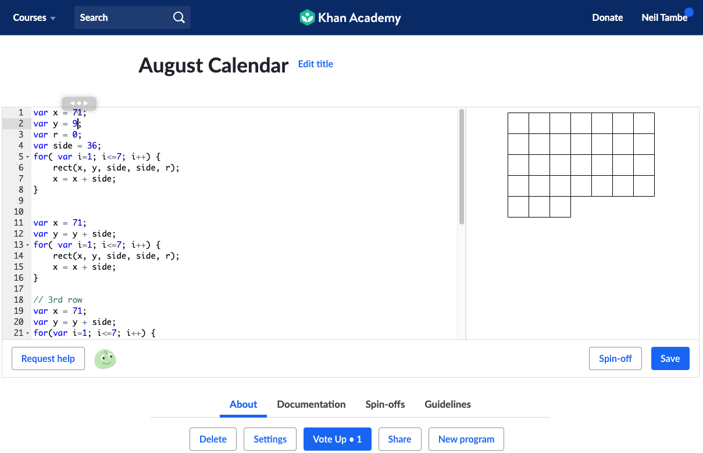

# ElementaryProgramming

This my first Github repository so don't judge.

## My Khan Academy Programs

### Keyboard program
My Keyboard program has many for loops and it took 45 mins. [click here](https://www.khanacademy.org/computer-programming/keyboard/6034445664468992).

### My August Calendar Program
My August Calendar Program has 31 squares and I kind of followed the three rules of programming.

### Three rules of Programming          
1. Do not repeat yourself.
2. No hardcoded values.
3. No dead code.

